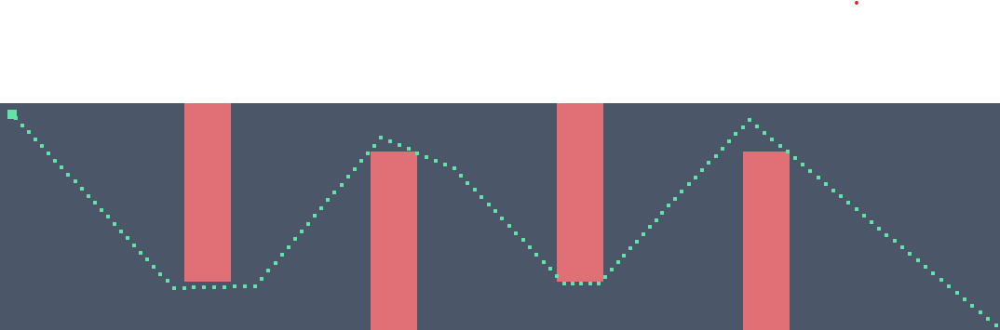
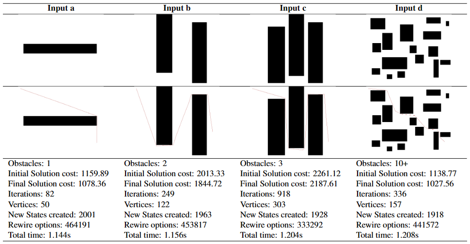
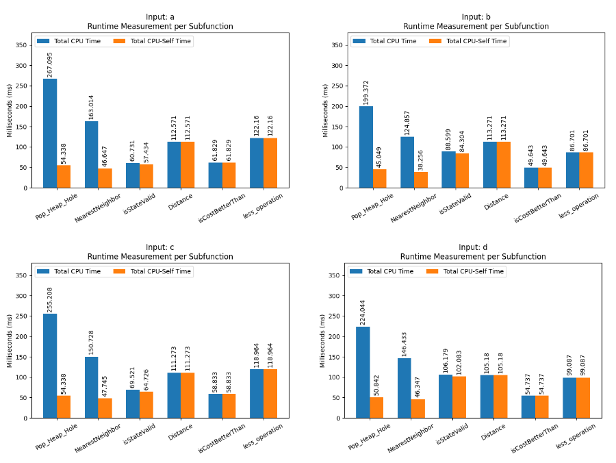

# Performance Analysis of RRT* Algorithm
### Team Members - Prithviraj Khelkar, Jonas Raedlar, Shiven Sharma
### Project for CS599N1 - Robot Brains Course by Prof. Sabrina Neumann



## Packages Required
* ```ompl```
* ```opencv2```
* ```sdl2```

## Instructions
* The file ```simpleRRTStar.h``` contains code for rrt* on stationary scenes, this can be extended to 3 dimensions by adding a new bound in the state space.
* The file ```armRRTStar.h``` contains code for rrt* on robots with higher DOF scenes.
* The file ```PathEngine.h``` contains code for rrt* on dynamic scenes. It inherits ```Engine.h```
* Extend the class ```Engine.h``` to create custom scenes. And extend the class ```Robot.h``` to create custom robots.
* ```globals.h``` contains important constants, for example ```DELTA_TIME``` for the simulation of dynamic scenes.

## Goals
Motion planning algorithms play a pivotal role in robotics, with many state-of-the-art algorithms and planners available across multiple platforms and libraries. One of the algorithms is the Rapidly exploring random tree (RRT) and RRT* algorithms, known for its probabilistic completeness and asymptotic optimality. However, RRT* itself introduces computational complexities and limitations. This project presents a comprehensive investigation into the constraints of RRT*. We conduct various experiments on a variety of scenarios in which the algorithm might be used, including 2 and 3-dimensional spaces, as well as stationary and dynamic scenes, using Intel's VTune profiler. Additionally, a state-of-the-art implementation of the Open Motion Planning Library (OMPL) is detailed. The project concludes with insights into the algorithm's performance, laying the foundation for future enhancements and applications.


## Data
### Stationary Scenes


